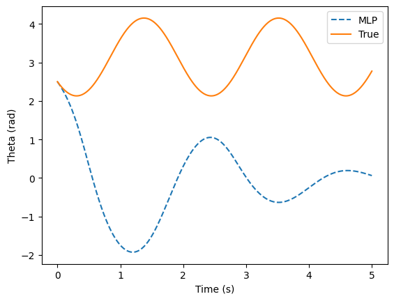
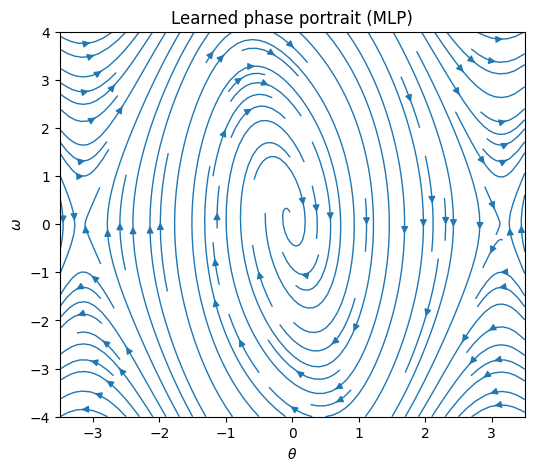

### Second model
In this experiment, the MLP learns to predict the state derivatives (d_theta, d_omega) from the state (theta, omega).  The learned vector field is then integrated using the RK4 method to generate trajectories.

#### Trajectory
- The predicted trajectory using MLP differs significantly from the true trajectory. In particular, the learned dynamics shows a stable equilibrium point at θ=0, whereas the true pendulum has its stable equilibrium at θ=π. Moreover, the amplitude of the oscillations decreases over time despite the data being generated from a conservative system.

#### Phase portrait
- The learned phase portrait clearly shows a spiral-like pattern converging toward a single attractor at (0,0), which indicating artificial energy dissipation. This behavior arises from the lack of physical constraints such as energy conservation in the MLP architecture. As a result, despite achieving a low local prediction error, the learned dynamics fail to reproduce the correct long-term qualitative behavior of the system.

