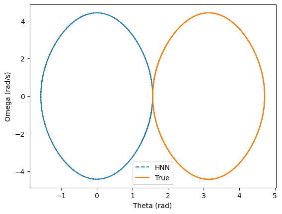

### Forth model
In this experiment, the neural network is trained to learn the Hamiltonian of the system. The state derivatives are then recovered using Hamilton’s equations. Compared to the previous experiments, the training dataset was modified.
The dataset was constructed such that approximately 1/50 of the samples correspond to low-energy trajectories (about 300 points). The train–test split was designed to ensure that low, medium, and high energy trajectories are present in both the training and test sets. Moreover, a new loss term was introduced in an attempt to force the neural network to place the stable equilibrium point at θ=π.

#### Trajectory
- Despite despite failing to learn that the stable equilibrium point is located at pi, the neural network is able to generate physically consistent trajectories. In particular, it succesfully reproduces the correct iscillations amplitude and period, even for initial condition away from the equilibrium point.

#### Phase portrait
- The neural network is now able to generate closed phase space trajectories when the system does not have sufficent energy to do a full rotation, which is consistent with the expected behavior of the pendulum.

#### Analysis
- Despite explicitly penalizing incorrect equilibrium positionning throught a new loss term, the neural network is consistently positionning the equilibrium point at θ=0 instead of θ=π.
- This behavior clearly shows an identifiable issue: while the learned Hamiltonian produces correct dynamics, the position of the equilibrium point is not uniquely determined by the equations of motion alone.
