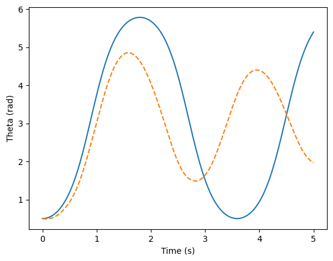

# Inverted-Pendulum-Neural-ODE
This project investigates the learning of nonlinear physical dynamics using neural networks, with the inverted pendulum as a benchmark system. The goal is to compare different learning strategies—from unconstrained neural networks to physics-informed architectures and analyze their ability to reproduce the qualitative and quantitative properties of a conservative dynamical system.

## Physics validation of the rk4 method
We first validate the numerical integration of the inverted pendulum dynamics by analyzing energy conservation and phase-space structure. The goal of this step is to ensures that the simulator provides physically consistent trajectories before any learning stage.
- 

## Results of the MLP
### First model
In this first experiment, the MLP directly predicts the next state of the system given the current state and the applied control force \( u \).

#### One-step prediction
- The MLP achieves low error in the one-step prediction task.
- Both training and test losses converge quiclky toward 1e-3, 1e-4.

#### Long-term rollout
- The learned dynamics reproduces the qualitative behavior of the trajectory.
- However, the amplitude and frequency of the trajectory is diverging from the true dynamics over time.

#### Energy analysis
- The true system conserves mechanical energy.
- The MLP mechanical energy tend to diverge over time.

#### Phase portrait
- The phase-space structure is approximately captured.
- The long-term trajectories diverge from the expected dynamics due to error accumulation.
- The lack of closed trajectories in the learned phase portrait is a consequence of the model not conserving the mechanical energy.

### Second model
In this experiment, the MLP learns to predict the state derivatives (d_theta, d_omega) from the state (theta, omega).  The learned vector field is then integrated using the RK4 method to generate trajectories.

#### Trajectory
- The predicted trajectory using MLP differs significantly from the true trajectory. In particular, the learned dynamics shows a stable equilibrium point at θ=0, whereas the true pendulum has its stable equilibrium at θ=π. Moreover, the amplitude of the oscillations decreases over time despite the data being generated from a conservative system.
- 

#### Phase portrait
- The learned phase portrait clearly shows a spiral-like pattern converging toward a single attractor at (0,0), which indicating artificial energy dissipation. This behavior arises from the lack of physical constraints such as energy conservation in the MLP architecture. As a result, despite achieving a low local prediction error, the learned dynamics fail to reproduce the correct long-term qualitative behavior of the system.

### Third model
In this experiment, the neural network is trained to learn the Hamiltonian of the system. The state derivatives (d_theta, d_omega) are then recovered from the Hamiltonian using Hamilton’s equations, ensuring a conservative vector field by construction.

### Trajectory
- The trajectory build using the prediction of the HNN differs from the true trajectory despite the leanred Hamiltonian.

### Phase portrait
- The learned phase portrait clearly shows open trajectories whereas closed shape trajectories were exepted for a conservative system.

### Analysis
- Even thought the learned Hamiltonian is conserved, it does not correctly captures the physical strucure of the system.
- This discrepancy probably arises from the lack of physical constraint such as the periodicity of theta (and maybe the lack of data around the value of pi).
- As a result, the model learn a conserved quantity with the wrong typology leading to wrong trajectories.
  
